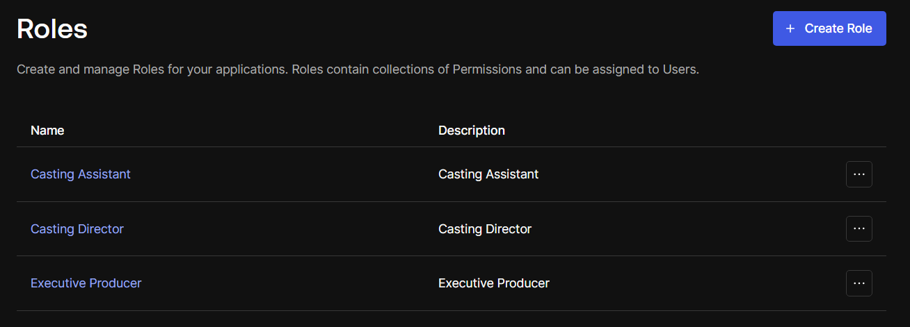
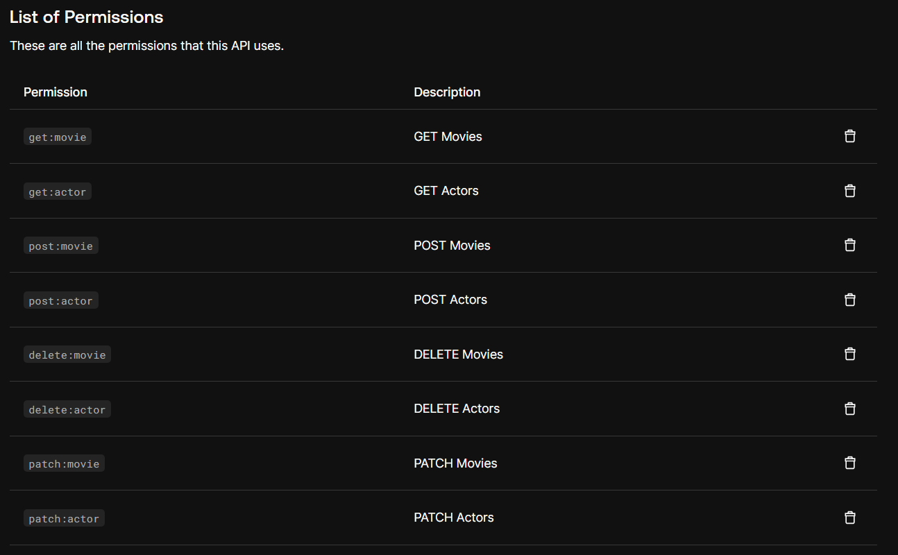

# Udacity Capstone Project

## Project Overview

This project is the capstone project for the Udacity Full Stack Developer Nanodegree. The project is a simple web application that allows users to create, read, update, and delete items in a database. The application is built using Python, Flask, and PostgreSQL.

To follow the best practices, the application was developed using Pylint for linting and Pytest for testing.

## Running the Application

### Setup

1. Clone the repository

```bash
git clone https://github.com/DinizMaths/udacity-fsnd-capstone.git
```

2. Change into the project directory

```bash
cd udacity-fsnd-capstone
```

3. Install the required packages

```bash
pip install -r requirements.txt
```

## Endpoints

The endpoints are protected by Auth0 and require a valid JWT token to access. The following roles and permissions are available:



Additionally, the following permissions are available:



### Get Movies

- **URL**: `/movies`
- **Method**: `GET`
- **Permissions Required**: `get:movie`
- **Roles**: [Casting Assistant, Casting Director, Executive Producer]

### Get Actors

- **URL**: `/actors`
- **Method**: `GET`
- **Permissions Required**: `get:actor`
- **Roles**: [Casting Assistant, Casting Director, Executive Producer]

### Post Movie

- **URL**: `/movies`
- **Method**: `POST`
- **Permissions Required**: `post:movie`
- **Roles**: [Executive Producer]

### Post Actor

- **URL**: `/actors`
- **Method**: `POST`
- **Permissions Required**: `post:actor`
- **Roles**: [Casting Director, Executive Producer]

### Delete Movie

- **URL**: `/movies/<movie_id>`
- **Method**: `DELETE`
- **Permissions Required**: `delete:movie`
- **Roles**: [Executive Producer]

### Delete Actor

- **URL**: `/actors/<actor_id>`
- **Method**: `DELETE`
- **Permissions Required**: `delete:actor`
- **Roles**: [Casting Director, Executive Producer]

### Patch Movie

- **URL**: `/movies/<movie_id>`
- **Method**: `PATCH`
- **Permissions Required**: `patch:movie`
- **Roles**: [Executive Producer]

### Patch Actor

- **URL**: `/actors/<actor_id>`
- **Method**: `PATCH`
- **Permissions Required**: `patch:actor`
- **Roles**: [Casting Director, Executive Producer]